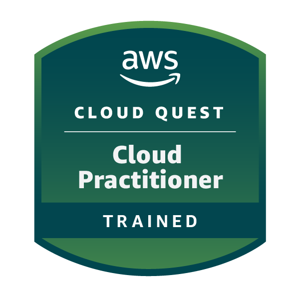
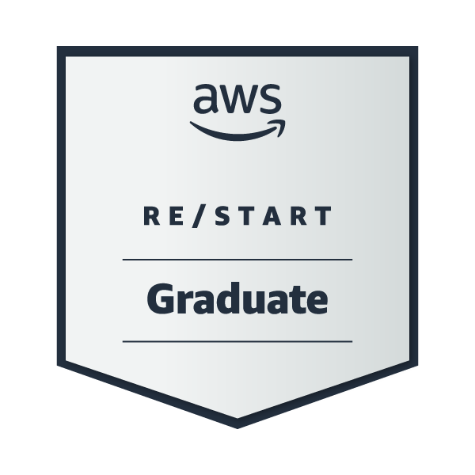

## ☁️ Charting My Course: From Service Expert to Cloud Practitioner

Hello, and welcome! I’m **Kebaabetswe A. Sennelo**, and if you’re reading this, you’re catching me at a pivotal moment: the transition from a background of service delivery to a dedicated career in technology.

My professional foundation was built in the demanding world of customer service, culminating as a Senior Escalations Consultant. This role was the ultimate proving ground for reputation management, systematic problem solving, and critical service delivery skills that translate directly to building reliable, high-performing systems. I learned that success isn't just about functionality; it's about trust, resilience, and reliability.

My passions have always centered around creation and protection. For years, I found creative expression in digital aesthetics, but beneath that surface interest, a deeper curiosity always simmered; the fascination with what makes systems tick, how they communicate, and critically, how to keep them safe.

My ambition is clear: to evolve from an emerging Backend Developer focused on the logic, data, and APIs powering applications into a seasoned Cybersecurity Specialist the professional who ensures those systems are impermeable, reliable, and trusted. I see the cloud as the essential training ground for mastering both architecture and defense.

## About Me: The Deliberate Ascent into Tech

My journey into technology wasn't conventional; it was a slow, deliberate ascent driven by relentless curiosity and a willingness to **learn and pivot**. My transition began in late 2024, starting with self-taught web creation using drag-and-drop platforms like nicepage.io and later, the no-code tool Bolt.ai. This quickly fueled my desire to understand the underlying code.

I dove into structured learning on Codecademy.com to master the fundamentals of *HTML, CSS, and JavaScript*. This self-starter mentality was validated when I successfully applied to the **PLP Africa Software Development scholarship program**.

This intensive, 16-week program provided a robust foundation, covering **Web Technologies, Database Management, Python, and Software Engineering Essentials**, with a specialization in **Full-Stack MERN Stack** development. This immersive experience cemented my dedication to coding and system architecture.

Earning a place in this competitive scholarship and successfully completing the program validated my commitment, but it was stepping into the **AWS re/Start Cloud Practitioner program** that truly felt like finding my professional north.

AWS re/Start isn't just a certification path; it’s an immersive deep dive that has transformed my understanding of IT infrastructure. Suddenly, I wasn't just reading about the cloud; I was operating in it, and gaining hands-on expertise in the foundational infrastructure that powers modern applications:

* **Cloud Compute & EC2:** Learning to provision and manage EC2 instances taught me the fundamentals of computing resources, understanding how to select the right instance type for the job, and the concept of elasticity.
* **Networking & VPC:** The labyrinthine world of networking became navigable by understanding the Virtual Private Cloud (VPC), making the internet feel less like magic and more like an *organized, secure community*.
* **Storage & S3:** I discovered the power of AWS S3, not just for backing up files, but as a powerful platform for hosting high-performance, static websites, a direct evolution of my initial web design interest.
* **Linux & Bash:** Mastering Linux and the Bash terminal provided a vital technical lingua franca, empowering me to manage systems directly and automate tasks, moving beyond graphical interfaces into the heart of the machine.
* **Databases:** I gained an introduction to the landscape of AWS databases, learning that data isn't a one-size-fits-all problem, but that services like RDS (relational) and DynamoDB (NoSQL) each have their perfect use case.
* **Security Services:** Crucially, I learned about foundational security, navigating Security Groups, network Subnets, and the multi-layered security model that underpins every cloud deployment.

## Badges 

  
  

  

  

  

## Certificates

  
  
  
  
  
  
  
  
  

## Skills, Technologies, and The Lessons Learned

The technical skills acquired are the currency of this industry, but the lessons I found most valuable are centered around how we apply that knowledge in a professional environment; a mindset directly informed by my background in high-level service.

**Hard Skills & Technologies:**

* **Cloud Fundamentals:** AWS Core Services (EC2, VPC, S3, IAM, CloudFront, Route 53, CloudWatch).
* **Backend & Development:** Python, JavaScript, HTML, CSS, MERN Stack (MongoDB, Express, React, Node.js).
* **System Administration:** Linux and Bash scripting.
* **Networking:** Subnetting, CIDR, Security Groups, and NACLs.
* **Database Management:** Introduction to Relational vs. NoSQL (DynamoDB).
* **Web Services:** Static website hosting and CDN implementation.

**Soft Skills & Professional Insight:**

* **Critical Service Delivery (Reputation Management):** My experience as a Senior Escalations Consultant instilled a deep understanding of maintaining client trust and system reliability. This directly applies to my backend and security aspirations: ensuring the services I build are **reliable, responsive, and trustworthy** is the ultimate measure of success.
* **Systematic Problem Solving:** Moving from "Is it working?" to "*What exactly is failing, and why?*" using logs, monitoring, and methodical troubleshooting processes, honed over years of resolving complex customer issues.
* **Collaboration and Communication:** Learning to articulate complex technical challenges clearly to both technical and non-technical peers in a project setting.

## Group Project 1: Static Site with Serverless Backend

My first major collaborative project involved delivering a highly available, performant static website using a serverless approach. This was where theory met practice, and where I truly got to flex my emerging backend muscles.

Our team’s objective was to host a modern, secure website. My primary responsibility focused on the infrastructure delivery:

* Static Content Migration: I was tasked with migrating the website’s static assets onto AWS S3, ensuring the bucket was configured correctly for website hosting, complete with appropriate permissions (while adhering to the principle of least privilege).
* Performance & Global Delivery: To achieve low-latency delivery, I implemented AWS CloudFront, configuring it to act as the Content Delivery Network (CDN) caching the S3 content globally.
* Backend Integration (DynamoDB): My most exciting task was setting up the basic backend infrastructure. We chose DynamoDB as our serverless, NoSQL database to handle simple interactions. This allowed me to integrate a fully managed database solution, proving the concept of a modern, scalable web architecture that is completely decoupled from traditional, stateful servers.

This project was a revelation, showing me the real-world application of the modules we studied and cementing my passion for building out the reliable, scalable systems that power the digital landscape.

## Group Project 2: 3D Architecture Design Document for E-Commerce store

## Conclusion

This document marks a crucial milestone in a dedicated career in technology. The AWS re/Start program, built upon my solid self-taught foundation in MERN Stack and Python, has equipped me not only with invaluable skills like working with VPCs and DynamoDB but, more importantly, with a robust methodology for approaching technical challenges and a deep appreciation for service delivery.

The journey from a high-level Service Consultant to a certified Cloud Practitioner is well underway. I am highly motivated to continue down the path of Backend Engineering to master system architecture, with the ultimate professional goal of specializing in the vital field of Cybersecurity.

I am eager to contribute my unique blend of technical expertise and high-pressure service experience to a team focused on building secure and reliable solutions. I’m ready for the next challenge, eager to learn, and excited to build.

## Connect With Me
LinkedIn Profile: www.linkedin.com/in/kebaabetswe-a-sennelo-28226130
Contact Details: ka.sennelo@gmail.com